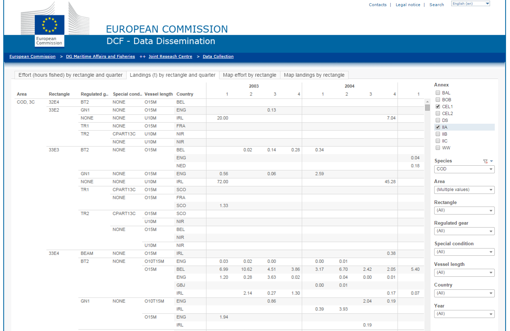

This document summaries the fisheries dependent data for cod around the Irish Sea. It is generated using r Markdown code for easy reproducibility, further analysis and development as required. The first step is download the data from the JRC website and read it into R.  I download the detailed data for VIIa, VIa and VIIb-k (Annex IIa; 3c&3d and Cel1) and re-aggregate and summaries in R as required. 

[https://datacollection.jrc.ec.europa.eu/dd/effort/maps](https://datacollection.jrc.ec.europa.eu/dd/effort/maps).





Next I plot the time series of landings data to make sure that it is of similar magnitude to that reported by ICES for this stock.  The ICES landings estimates were obtained from the stock summary sheet at the following web address. [http://www.ices.dk/sites/pub/Publication%20Reports/Advice/2014/2014/cod-iris.pdf](http://www.ices.dk/sites/pub/Publication%20Reports/Advice/2014/2014/cod-iris.pdf).

```{r, message=FALSE, echo=FALSE, warning=FALSE}
library(dplyr)
library(ggplot2)
library(mapplots)
library(tidyr)
library(knitr)
setwd("~/GitHub/STECF_by_rect")
cod <- read.csv("./Landings_(t)_by_rectangle_and_quarter_data.csv")
eff <- read.csv("./Effort_(hours_fished)_by_rectangle_and_quarter_data.csv")

cods <- cod %>% group_by(Year, Rectangle) %>% summarise(t=sum(Measure.Values))
cods$yr <- paste0(cods$Year, cods$Rectangle)
eff$Measure.Values <- as.numeric(as.character(sub(",","", eff$Measure.Values)))
effs <- eff %>% group_by(Year, Rectangle) %>% summarise(hrs =sum(as.numeric(as.character(Measure.Values))))
effs$yr <- paste0(effs$Year, effs$Rectangle)
cods <- left_join(cods, effs, by="yr")
cods <- cods[,c(1:3,7)]
names(cods) <- c("Year", "Rectangle",      "t", "hrs")
cods <- cbind(ices.rect(cods$Rectangle), cods)

col <- terrain.colors(12)
cods$col <- col[match(cods$Year-2002,1:12)]

names(cod)[1] <- "Area"
cod7a <- cod %>% filter(Area == "3C") %>% group_by(Year) %>% summarise(Landings=sum(Measure.Values))
plot(cod7a, type= "l", ylim=c(0,1100))
lines(2003:2013, c(1285, 1072, 910, 840, 702, 661, 468, 464, 368, 198, 206), lty=3, col="red")

```

**Figure 1.** Time series cod landings in VIIa from the STECF database. The black line is the STECF data the red line is the ICES estimates.

Landings have declined from `r round(cod7a[1,2],0)`t at in 2002 to a minimum of `r round(filter(cod7a, Landings==min(cod7a$Landings))[2],0)` in `r filter(cod7a, Landings==min(cod7a$Landings))[1]`.  The ICES estimates of total landings from VIIa and the STECF landings data by rectangle are very similar over the time series. This confirms that the data in the STECF database are fairly complete and very similar to those used by ICES.

The next step is to investigate the spatial distribution of the reported landings by rectangle in the Irish Sea.

```{r, fig.height=7, fig.width=6, echo=FALSE}
data(coast)
xlim <- c(-8,-3)
ylim <- c(51.5,55.5)
basemap(xlim, ylim, main = "Cod landings and effort by year around VIIa")
draw.rect(lty=1, col=1)
draw.shape(coast, col="cornsilk")
lines(x= c(-6,-5.1), y=c(55, 55), col="red")
lines(x= c(-7.6,-5.2), y=c(52, 52), col="red")

draw.xy(cods$lon, cods$lat, cods$Year, cods$t, width=1, height=0.5,
        col=cods$col, type="h",lwd=3, border=NA)

draw.xy(cods$lon, cods$lat, cods$Year, cods$hrs, width=1, height=0.5, col="darkblue",
         type="l", border=NA)

legend("bottomright", c(2003:2014,"Effort Hrs"), pch=c(rep(22,12),16), pt.bg=c(col,NA),
      pt.cex=c(rep(2,12),0.8),col=c(rep(1,12),"darkblue"), lty=c(rep(NA,12),1), bg="lightblue",
      inset=0.02, title="Landings", cex=0.8)

cod7ar <- cod %>% filter(Area == "3C") %>% group_by(Rectangle) %>% summarise(Total=sum(Measure.Values))
high <- arrange(cod7ar, desc(Total))[1,1]
```

**Figure 2.** Time series cod landings and effort in hours for all fishing gears in VIIa by ICES rectangle from the STECF database.

Reported landings have declined significantly over time but the landings remain higher in the western Irish Sea relative to other areas. The highest landings over the time series were from `r high` which is coincident with the main Nephrops fishery.
Almost all rectangles show a strongly declining trend since 2003 (Figure 3).  There is also some spatial coherence in the patterns observed for example in 38E4 and 37E4 landings were relatively stable up to 2010 but after that there was a sharp decline.


```{r, echo=FALSE, message=FALSE, fig.height=9, fig.width=8}
cod7a <- cod %>% filter(Area == "3C") %>% group_by(Year, Rectangle) %>% summarise(Landings=sum(Measure.Values))

ggplot(cod7a, aes(Year, Landings)) + geom_line() + theme_bw() + facet_wrap(~Rectangle, scales="free_y") +
  theme(axis.text.x = element_text(angle=90, vjust = 0.5)) + 
   scale_x_continuous(breaks = c(seq.int(min(cod7a$Year), max(cod7a$Year), 2)))
```

**Figure 3.** Time series cod landings in VIIa by ICES rectangle from the STECF database (with relative y scales).

The time series of landings for the top 5 rectangles is given in table 1 below.

**Table 1.** Time series of landings for the top 5 ICES rectangle in VIIa
```{r, echo=FALSE, message=FALSE, fig.height=9, fig.width=8}
cod7a <- cod %>% filter(Rectangle %in% c("36E4", "38E4", "37E4", "35E4", "37E5")) %>% 
  group_by(Year, Rectangle) %>% summarise(Landings=sum(Measure.Values))
kable(spread(cod7a, Rectangle, Landings), digits=0)

```

The time series of cod landings by regulated gear type in the cod long term management plan is shown in Figure 4.  Landings of the three main gear groups, TR1 - otter trawlers with cod ends >99mm, TR2 - otter trawlers with cod ends 70-99mm and BT2 - beam trawlers with cod ends 70-99mm all show significant declines in landings over the time series.


```{r, echo=FALSE, message=FALSE, fig.height=5, fig.width=7}
cod7a <- cod %>% filter(Area == "3C") %>% group_by(Year, Regulated.gear) %>% summarise(Landings=sum(Measure.Values))

ggplot(cod7a, aes(Year, Landings, colour= Regulated.gear)) + 
  geom_line() + theme_bw() 

eff7a <- eff %>% filter(Regulated.area == "3C") %>% group_by(Year, Regulated.gear) %>% summarise(hrs=sum(Measure.Values))

cod7a <- left_join(cod7a, eff7a, by=c("Year" , "Regulated.gear"))

cod7a$lpue <- with(cod7a, Landings/hrs*1000)
cod7ag <- cod7a %>% group_by(Regulated.gear) %>% summarise(meanlpue=mean(lpue))
```


**Figure 4.** Time series cod landings in VIIa by gear from the STECF database.

The effort metric reported by rectangle in the STECF database is hours fished.  How this is estimated across different member states may differ.  In Ireland it is based on hours reported in the logbooks and this has in the past been strongly correlated with other effort metrics (e.g. days fished, days at sea, KwDays).  Effort of the three main cod catching gears all show declining trends over the time serise. The largest decline has been in the TR1 gear group where effort has droped from 200khrs in 2003 to 11khrs in 2014.  

The highest reported lpue has been in the TR1 gear group (with and average annual lpue of `r round(cod7ag[cod7ag$Regulated.gear=="TR1",2],1) `kg/hr.  Lpue showed and increasing  trend up to 2009 but has declined thereafter to `r round(cod7a[cod7a$Regulated.gear=="TR1" & cod7a$Year == 2014,5],1) `kg/hr.  The lowest lpue throughought the time serise has been in the TR2 gear group  with a mean lpue of `r round(cod7ag[cod7ag$Regulated.gear=="TR2",2],1) `kg/hr.  This gear group includes the *Nephrops* métier and accounts for the majority of the cod catching effort in VIIa (note there is significant effort in pot and dredge fisheries in VIIa but cod catches tend to be very minor). 

```{r, echo=FALSE, message=FALSE, fig.height=5, fig.width=7}

ggplot(subset(cod7a, Regulated.gear %in% c("TR1", "TR2", "BT2")), 
              aes(Year, hrs/1000, colour= Regulated.gear)) + 
              geom_line() + theme_bw() + ylab("Effort ('000s Hours)") +
              scale_x_continuous(breaks = c(seq.int(min(cod7a$Year), max(cod7a$Year), 2))) 


ggplot(subset(cod7a, Regulated.gear %in% c("TR1", "TR2", "BT2")), 
              aes(Year, Landings/hrs*1000, colour= Regulated.gear)) + 
              geom_line() + theme_bw() + ylab("Cod lpue kg/hr") +
              scale_x_continuous(breaks = c(seq.int(min(cod7a$Year), max(cod7a$Year), 2)))

```


**Figure 5.** Time series effort (top panel) and cod lpue (bottom panel) in VIIa for main cod catching gears from the STECF database.


**Table 2.** Time series of effort in hours fished for the main cod landing gears in VIIa.

```{r, echo=FALSE, message=FALSE, fig.height=7, fig.width=7}
cod7a <- cod7a %>% filter(Regulated.gear %in% c("TR1", "TR2", "BT2")) 
kable(spread(cod7a[,c(1:2,4)], Regulated.gear, hrs), digits=0)
```


```{r, eval= FALSE, echo=FALSE, message=FALSE, fig.height=7, fig.width=7}
# this is a half baked idea for a matrix plot
cod7a <- cod %>% filter(Area == "3C" & Year >= 2011) %>% group_by(Rectangle, Regulated.gear) %>% summarise(Landings=sum(Measure.Values)/3)

ggplot(cod7a, aes(y = Rectangle, x = Regulated.gear)) +
  geom_tile(aes(fill = Landings)) +
  geom_text(aes(label = round(Landings, 0))) +
  scale_fill_gradient(low = "white", high = "red") +
  theme_light() +
  theme(axis.text.x = element_text(angle=90, vjust = 0.5))
#**Figure 6.** Matrix of average landings for the last three years by gear and rectangle.

```

